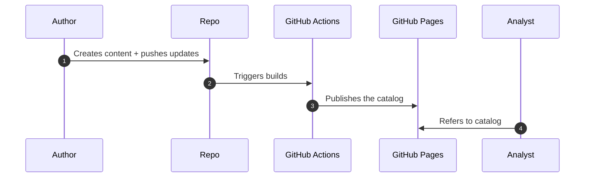

# Biomarker Analysis Catalog

Catalog for tables and graphs produced by Statistical Engineering products.

## Architecture

This repository follows a very straightforward architecture.



## Technology

- Dependency management: [`staged.dependencies`](https://openpharma.github.io/staged.dependencies/) for installing dependencies
- Building and rendering: [`Quarto`](https://quarto.org/)
- Publishing: [`GitHub Actions`](https://docs.github.com/en/actions)
- Hosting: [`GitHub Pages`](https://pages.github.com/)

## Development

This repository is based on the [Quarto books](https://quarto.org/docs/books/) framework.

As a pre-requsite, you need to [install Quarto](https://quarto.org/docs/get-started/) and also [install and configure staged.dependencies](https://github.com/openpharma/staged.dependencies#usage).

You can install dependencies simply by running the following in an R session:

```R
# Assuming:
# 1. Your current working directory is the same as the project directory
# 2. You have set up your GITHUB_PAT environment variable
options(
  staged.dependencies.token_mapping = c(
    "https://github.com" = "GITHUB_PAT"
  )
)
library(staged.dependencies)
x <- dependency_table(project = ".", verbose = 1)
install_deps(x, verbose = 1, install_project = FALSE)
```

Then, install this "package" (because it's not really a package, but it emulates a package as it has a `DESCRIPTION` file from which metadata is inferred):

```shell
R CMD INSTALL .
```

You'll see that files under [tables](tables) and [graphs](graphs) are in a `.qmd` file format, which translates to a **q**uarto **m**ark**d**own format. Note that the format is _almost exactly_ the same as Rmarkdown, with some minor differences, so you would write content within those files exactly as you would write Rmarkdown.

If you are adding a new table or graph in the form a a new `qmd` file, then you will also need to update the index in the [_quarto.yml](_quarto.yml) file with the new file name.
